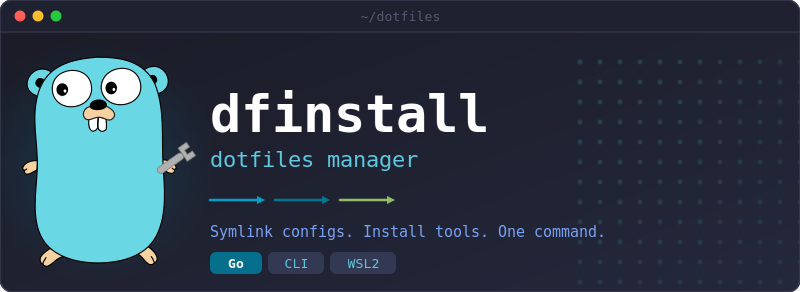

<p align="center">
  
</p>

Personal dotfiles manager built in Go. A single `dfinstall` CLI symlinks config files into place, installs packages and tools, and keeps everything reproducible across machines.

Built for WSL2 (Debian/Ubuntu) but works on native Linux with apt, dnf, pacman, or brew.

## Quick Start

```bash
git clone https://github.com/sresarehumantoo/dotfiles ~/dotfiles
cd ~/dotfiles
make install
```

`make install` compiles the CLI and runs `dfinstall install all`, which walks through every module in dependency order: system packages, shell setup, editor configs, dev tools, and WSL-specific tuning.

## Usage

```bash
dfinstall install all             # install everything
dfinstall install shell           # install a single module
dfinstall install all -v          # verbose output (detailed logs)
dfinstall install all --debug     # debug output (verbose + internals)
dfinstall install all --backup    # snapshot targets before modifying (restorable)
dfinstall install omz --extended  # interactive menu to select extended OMZ plugins
dfinstall update all              # re-apply all modules (alias for install)
dfinstall update omz --extended   # update and select extended OMZ plugins
dfinstall status                  # show link status for all modules
dfinstall doctor                  # run environment health checks
dfinstall restore                 # restore latest backup
dfinstall restore <timestamp>     # restore a specific backup
dfinstall restore --list          # list available backups
```

By default the CLI shows an animated spinner. Pass `-v` for the full log output or `--debug` for additional detail.

### Backup & Restore

On the very first `install` run, dfinstall automatically creates a backup before modifying anything. After that first run, a `.config.yaml` is saved in the dotfiles root with `skip_backup: true`, so subsequent runs skip backups by default.

You can override this behavior:

- **`--backup` flag** — always creates a backup, regardless of config
- **`skip_backup: false`** in `.config.yaml` — backup on every install
- **`backup_dir`** in `.config.yaml` — custom backup location (default: `~/.local/share/dfinstall/backups/`)

See `.config.yaml.example` for all available options.

```bash
dfinstall install all --backup    # force a backup
dfinstall restore --list          # see available snapshots
dfinstall restore                 # revert to latest snapshot
```

Each entry records the original state (missing, symlink, or regular file) so restore can precisely undo what dfinstall changed.

## Modules

Modules run in this order (dependencies first):

| Module | What it does |
|--------|-------------|
| **packages** | Core system packages via apt/dnf/pacman/brew (git, zsh, curl, neovim, tmux, node, python3, go) |
| **extras** | CLI utilities (fzf, ripgrep, bat, jq, fd), Python tooling, Docker, Terraform |
| **delta** | Installs [delta](https://github.com/dandavid/delta) git diff viewer |
| **fonts** | Hack Nerd Font and MesloLGS NF (bundled or downloaded) |
| **omz** | Oh My Zsh + zsh-autosuggestions + powerlevel10k + extended plugin support (`--extended`) |
| **shell** | Symlinks zshrc, bashrc, aliases, p10k config, and modular zsh.d files |
| **devtools** | Utility scripts to `~/.local/bin/` (sysinfo, docker-cleanup, git-prune-branches, etc.) |
| **git** | Symlinks gitconfig (delta pager, histogram diff, aliases) |
| **nvim** | Neovim config with Lazy.nvim plugin manager + headless sync |
| **tmux** | Tmux config (Alt+A prefix, vi mode, custom theme) |
| **ghostty** | Ghostty terminal emulator config |
| **htop** | htop config |
| **wsl** | WSL-specific: wsl.conf, sysctl tuning, .wslconfig, Windows home symlink, git fsmonitor |
| **defaultshell** | Sets zsh as the default login shell |

## Project Layout

```
.config.yaml.example     # Example dfinstall config (copied on first run)
assets/                  # Logo SVG and generator script
config/                  # Config files symlinked into ~
  shell/                 #   zsh/bash dotfiles
  devtools/              #   utility scripts -> ~/.local/bin/
  git/ nvim/ tmux/       #   tool configs
  ghostty/ htop/ wsl/    #   more tool configs
  fonts/                 #   bundled font files
src/
  cmd/dfinstall/         # CLI entry point (Cobra)
  core/                  # Module interface, linking, backup/restore, output, spinner, env detection
  modules/               # One file per module
tests/                   # Unit tests
docs/                    # In-depth documentation
```

## Make Targets

```
make build      # compile to bin/dfinstall
make test       # go test ./src/... ./tests/...
make lint       # go vet
make fmt        # gofmt -s -w
make install    # build + dfinstall install all
make clean      # rm -rf bin/
```

## Building from Source

**Requirements:**

- Go 1.24+ ([install](https://go.dev/doc/install))
- Git
- Make (optional, for convenience targets)

```bash
git clone https://github.com/sresarehumantoo/dotfiles ~/dotfiles
cd ~/dotfiles
make build          # compiles to bin/dfinstall
```

Or without Make:

```bash
go build -ldflags "-X github.com/sresarehumantoo/dotfiles/src/core.DefaultDotfilesDir=$(pwd)" \
  -o bin/dfinstall ./src/cmd/dfinstall
```

The `-ldflags` flag bakes the dotfiles directory path into the binary so it can find config files regardless of where it's run from. Dependencies are vendored via `go.sum` and fetched automatically on first build.

See [Building from Source](docs/building.md) for more detail on dependencies, cross-compilation, and development setup.

## Documentation

- [Architecture](docs/architecture.md) -- core systems, module interface, output pipeline, linking
- [Building from Source](docs/building.md) -- requirements, dependencies, cross-compilation
- [Module Reference](docs/modules.md) -- detailed breakdown of every module
- [Devtools Scripts](docs/devtools.md) -- utility scripts and shared helpers
- [Contributing](docs/contributing.md) -- adding modules, conventions, testing
